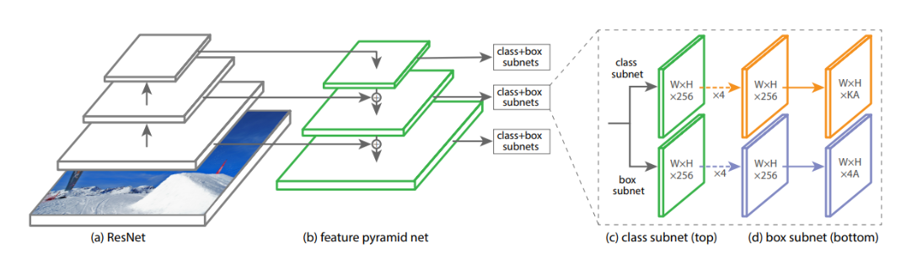
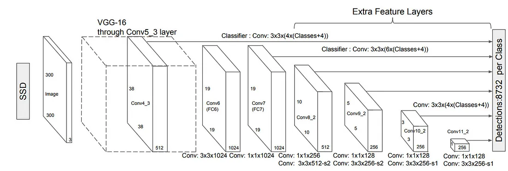
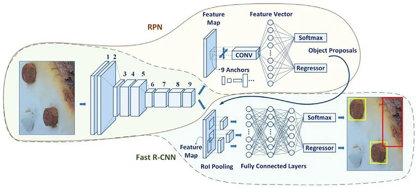

# Object Detection in Images: Retina Net, SSD, and Faster R-CNN

This project explores and compares three popular object detection models: Retina Net, SSD, and Faster R-CNN. The goal is to understand their architectures, strengths, and weaknesses in the context of real-world object detection tasks.

## Datasets: COCO vs. Pascal VOC
* **COCO:**

  * Larger dataset with over 200,000 images and 80 object categories.
    
  * More diverse scenes and object instances, offering a more realistic benchmark.
    
  * Generally considered more challenging due to its complexity.
    
* **Pascal VOC:**

  * Established dataset with around 20,000 images and 20 object categories.

  * Well-defined annotations and standardized evaluation metrics.

  * Good starting point for beginners due to its manageable size and clarity.

## Retina Net:

* **Overview:**

    Single-stage, FPN-powered detector, exceptional for small, dense objects (e.g., aerial imagery).

* **Architecture:**

    

    Backbone (ResNet) -> Multi-scale features (FPNs) -> Classification & Regression for objects.

* **Strengths:**

    Accurate small object detection, fast inference, ideal for aerial/satellite images.
  
* **Weaknesses:**

    More training data compared to some models, less flexible for specific object shapes.

## SSD (Single Shot MultiBox Detector):

* **Overview:**
  
     Combines single-stage detection with multi-scale feature maps for object localization and classification.

* **Architecture:**

     
      
     Uses multiple convolutional layers at different scales to predict bounding boxes and class probabilities.

* **Strengths:**

     Faster than Faster R-CNN while maintaining reasonable accuracy.

* **Weaknesses:**

     May struggle with small objects due to limitations of feature maps.

## Faster R-CNN (Region-based Convolutional Neural Network):

* **Overview:**
  
     Two-stage model proposes regions of interest (ROIs) and classifies them within those regions.

* **Architecture:**

     

     Utilizes a backbone like ResNet to extract features, followed by a region proposal network (RPN) and two classification stages.

* **Strengths:**
  
     High accuracy on object detection tasks.

* **Weaknesses:**

     Slower inference speed compared to single-stage models.
  
## Models Comparison: IoU and mAP

* **COCO Dataset**

| Metric | SSD | Faster R-CNN | Retina Net |
|---|---|---|---|
| mAP | 0.225 | 0.367 | 0.357 |
| IoU | 0.810 | 0.856 | 0.873 |

*  **Pascal VOC Dataset**

| Metric | SSD | Faster R-CNN | Retina Net |
|---|---|---|---|
| mAP | 0.469 | 0.522 | 0.554 |
| IoU | 0.819 | 0.815 | 0.829 |

